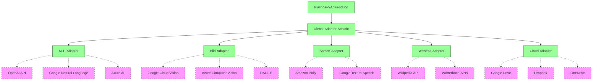
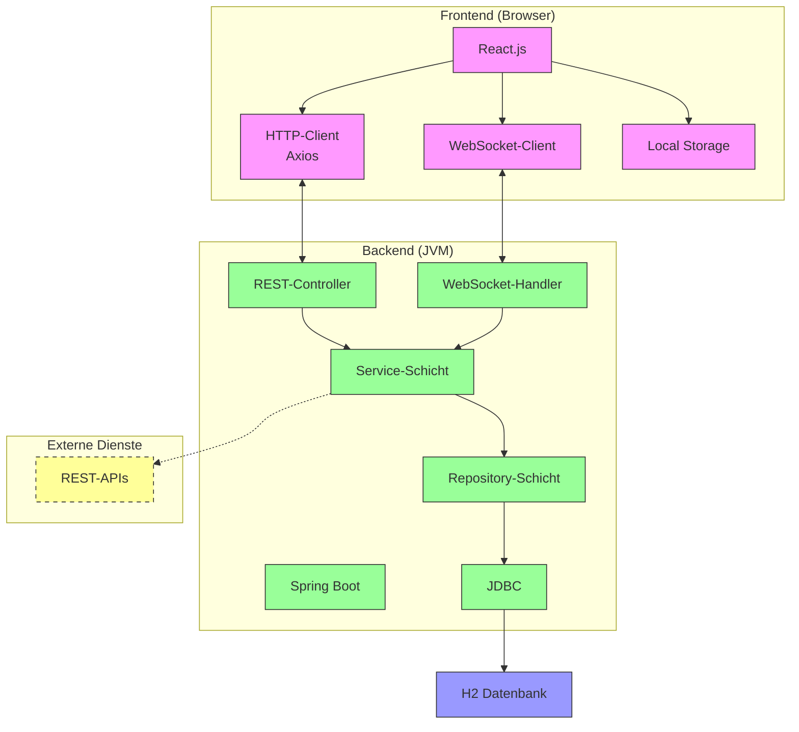

# 7. Verteilungssicht

## 7.4 Knoten 2: Optionale externe Dienste

### Beschreibung
Obwohl die Flashcard-Anwendung primär als lokale Anwendung konzipiert ist, die vollständig auf dem Rechner des Nutzers läuft, können optional externe Dienste angebunden werden, um bestimmte Funktionen zu erweitern oder zu verbessern. Diese externen Dienste bilden den zweiten logischen Knoten in der Verteilungsarchitektur, auch wenn sie physisch auf verschiedenen externen Servern laufen können.

#### Mögliche externe Dienste
Folgende Arten von externen Diensten können optional mit der Flashcard-Anwendung verbunden werden:

* **KI-Dienste für Karteikartengenerierung**:
  * Spezialisierte NLP-Dienste (Natural Language Processing) für die automatische Generierung von Karteikarten aus Texten
  * KI-basierte Dienste für die Optimierung und Qualitätsprüfung von Karteikarten
  * Übersetzungsdienste für mehrsprachige Karteikarten
  * Beispiele: OpenAI API, Google Cloud Natural Language, Azure Cognitive Services

* **Bilderkennungs- und Verarbeitungsdienste**:
  * Dienste zur Extraktion von Text aus Bildern (OCR)
  * Bilderkennungsdienste für die Kategorisierung von Bildern in Karteikarten
  * Dienste zur Generierung von Bildern für Karteikarten
  * Beispiele: Google Cloud Vision, Azure Computer Vision, OpenAI DALL-E

* **Sprachverarbeitungsdienste**:
  * Text-to-Speech-Dienste für die Aussprache von Vokabeln
  * Speech-to-Text-Dienste für sprachgesteuerte Eingabe
  * Beispiele: Google Cloud Speech-to-Text, Amazon Polly, Azure Speech Service

* **Wissensdatenbanken und Informationsquellen**:
  * Dienste für den Zugriff auf strukturierte Wissensdatenbanken
  * APIs für den Zugriff auf Enzyklopädien, Wörterbücher oder Fachquellen
  * Beispiele: Wikipedia API, Wiktionary API, fachspezifische Datenbanken

* **Cloud-Speicherdienste für Backup und Synchronisation**:
  * Dienste für die sichere Speicherung von Backups in der Cloud
  * Synchronisationsdienste für die Übertragung von Karteikarten zwischen verschiedenen Geräten
  * Beispiele: Dropbox API, Google Drive API, OneDrive API

Diese externen Dienste sind als Erweiterungen konzipiert, die die Grundfunktionalität der Anwendung ergänzen, aber nicht für deren Betrieb erforderlich sind.

#### Anbindung der externen Dienste
Die Anbindung der externen Dienste erfolgt über standardisierte Schnittstellen und Protokolle:

* **REST-API-Integration**:
  * Die meisten externen Dienste werden über HTTP/HTTPS-basierte REST-APIs angebunden
  * Standardisierte JSON- oder XML-Datenformate für den Austausch von Daten
  * OAuth 2.0 oder API-Schlüssel für die Authentifizierung und Autorisierung
  * Asynchrone Kommunikation für rechenintensive Operationen

* **Adapter-Architektur**:
  * Implementierung eines Adapter-Musters zur Entkopplung der externen Dienste von der Kernfunktionalität
  * Einheitliche interne Schnittstellen für verschiedene externe Dienste des gleichen Typs
  * Einfache Austauschbarkeit und Erweiterbarkeit der externen Dienste

* **Konfigurierbare Verbindungen**:
  * Benutzerfreundliche Konfiguration der Verbindungen zu externen Diensten über die Benutzeroberfläche
  * Speicherung von API-Schlüsseln und Zugangsdaten in verschlüsselter Form
  * Möglichkeit, verschiedene Dienste für verschiedene Funktionen zu verwenden

* **Caching und Offline-Nutzung**:
  * Caching von Ergebnissen externer Dienste für die Offline-Nutzung
  * Intelligente Wiederverwendung von Ergebnissen zur Reduzierung von API-Aufrufen
  * Lokale Zwischenspeicherung von häufig benötigten Daten
  * Priorisierung lokaler Ressourcen vor externen Diensten

#### Anforderungen an externe Dienste
Die externen Dienste müssen bestimmte Anforderungen erfüllen, um in die Flashcard-Anwendung integriert werden zu können:

* **Technische Anforderungen**:
  * REST-API oder andere standardisierte Schnittstelle
  * Unterstützung für JSON oder XML als Datenformat
  * Angemessene Antwortzeiten (idealerweise < 2 Sekunden)
  * Ausreichende Verfügbarkeit und Zuverlässigkeit
  * Unterstützung für asynchrone Anfragen bei rechenintensiven Operationen

* **Funktionale Anforderungen**:
  * Relevante Funktionalität für die Karteikartengenerierung oder -optimierung
  * Qualitativ hochwertige Ergebnisse, die den Lernprozess unterstützen
  * Anpassungsfähigkeit an verschiedene Lernkontexte und -inhalte
  * Unterstützung für die benötigten Sprachen und Fachgebiete

* **Datenschutz und Sicherheit**:
  * Sichere Übertragung der Daten (HTTPS)
  * Transparente Datenschutzrichtlinien
  * Keine dauerhafte Speicherung sensibler Nutzerdaten
  * Einhaltung relevanter Datenschutzbestimmungen

* **Kosten und Nutzungsbedingungen**:
  * Angemessenes Preis-Leistungs-Verhältnis
  * Verfügbarkeit kostenloser Kontingente für persönliche Nutzung
  * Faire Nutzungsbedingungen ohne übermäßige Einschränkungen
  * Transparente Preisgestaltung ohne versteckte Kosten

Die Anwendung ist so konzipiert, dass sie mit verschiedenen externen Diensten arbeiten kann, solange diese die grundlegenden Anforderungen erfüllen. Dies ermöglicht dem Nutzer die Auswahl der für seine Bedürfnisse am besten geeigneten Dienste.

#### Offline-Fähigkeit der Anwendung
Ein zentrales Designprinzip der Flashcard-Anwendung ist die vollständige Funktionsfähigkeit ohne externe Dienste:

* **Vollständige Kernfunktionalität offline**:
  * Alle wesentlichen Funktionen der Anwendung sind ohne Internetverbindung nutzbar
  * Karteikartenerstellung, Lernen, Fortschrittsverfolgung und Statistiken funktionieren vollständig offline. KI-Dienste können - müssen aber nicht - verwendet werden.
  * Lokale Speicherung aller Daten und Konfigurationen

* **Lokale Alternativen zu externen Diensten**:
  * Lokale Textverarbeitung für einfache Analysen und Extraktionen
  * Vorinstallierte Wörterbücher und Grundlagenwissen für häufige Anwendungsfälle

* **Graceful Degradation**:
  * Automatische Erkennung der Verfügbarkeit externer Dienste
  * Nahtloser Übergang zu lokalen Alternativen, wenn externe Dienste nicht verfügbar sind
  * Klare Kommunikation der verfügbaren Funktionalität an den Nutzer

* **Synchronisierung bei Wiederverbindung**:
  * Automatische Synchronisierung von Backups, wenn Cloud-Speicherdienste wieder verfügbar werden
  * Möglichkeit, offline erstellte Inhalte nachträglich durch KI-Dienste optimieren zu lassen
  * Priorisierte Verarbeitung wichtiger Aufgaben bei begrenzter Konnektivität

Diese Offline-Fähigkeit gewährleistet, dass die Anwendung in allen Lernszenarien zuverlässig funktioniert, unabhängig von der Verfügbarkeit externer Dienste oder einer Internetverbindung.

### Mögliche Visualisierungen
* **Dienstarchitektur-Diagramm**: Ein Diagramm, das die verschiedenen externen Dienste und ihre Anbindung an die Anwendung visualisiert.

* **Fallback-Strategie-Diagramm**: Ein Diagramm, das die Fallback-Strategien bei Nichtverfügbarkeit externer Dienste visualisiert.

## 7.5 Kommunikation und Protokolle

### Beschreibung
Die Kommunikation zwischen den verschiedenen Komponenten der Flashcard-Anwendung erfolgt über definierte Protokolle und Schnittstellen. Diese Kommunikationsmechanismen sind so gestaltet, dass sie effizient, zuverlässig und sicher sind, während sie gleichzeitig die Anforderungen an Offline-Funktionalität und lokale Ausführung erfüllen.

#### Verwendete Kommunikationsprotokolle
Die Flashcard-Anwendung nutzt folgende Kommunikationsprotokolle:

* **HTTP/HTTPS**:
  * Primäres Protokoll für die Kommunikation zwischen Frontend und Backend
  * RESTful API-Design mit standardisierten HTTP-Methoden (GET, POST, PUT, DELETE)
  * Verwendung von HTTPS für die sichere Kommunikation, auch bei lokaler Ausführung
  * Standardisierte Statuscodes und Fehlerbehandlung

* **WebSockets**:
  * Für Echtzeit-Benachrichtigungen und bidirektionale Kommunikation
  * Verwendung für Live-Updates während Lernsitzungen
  * Effiziente Übertragung von Statusänderungen ohne ständiges Polling
  * Automatischer Fallback auf HTTP bei Nichtverfügbarkeit

* **JDBC**:
  * Für die Kommunikation zwischen Backend und H2-Datenbank
  * Effiziente Ausführung von SQL-Abfragen und Transaktionen
  * Verbindungspooling für optimale Performance
  * Prepared Statements für sichere Datenbankzugriffe

* **Dateisystem-API**:
  * Für den Zugriff auf lokale Dateien (Import/Export, Medieninhalte, Backups)
  * Plattformunabhängige Implementierung über Java NIO
  * Asynchrone Operationen für I/O-intensive Aufgaben
  * Caching-Mechanismen für häufig genutzte Dateien

* **JNI (Java Native Interface)**:
  * Für die Integration nativer Bibliotheken, insbesondere für KI-Funktionen
  * Optimierte Schnittstelle für rechenintensive Operationen
  * Plattformspezifische Implementierungen für maximale Performance

Diese Protokolle wurden basierend auf ihrer Eignung für die jeweiligen Kommunikationsanforderungen, ihre Standardisierung und ihre Unterstützung in den verwendeten Technologien ausgewählt.

#### Kommunikationsmuster zwischen Frontend und Backend
Die Kommunikation zwischen dem React.js-Frontend und dem Spring Boot-Backend folgt verschiedenen Mustern, je nach Anforderung:

* **Request-Response-Muster**:
  * Synchrone Kommunikation für die meisten CRUD-Operationen
  * Frontend sendet HTTP-Anfragen an definierte API-Endpunkte
  * Backend verarbeitet die Anfragen und sendet strukturierte Antworten zurück
  * Verwendung von JSON als Datenformat für Anfragen und Antworten

* **Publish-Subscribe-Muster**:
  * Asynchrone Kommunikation für Ereignisbenachrichtigungen
  * Backend sendet Ereignisse über WebSockets an das Frontend
  * Frontend abonniert relevante Ereignistypen
  * Verwendung für Echtzeit-Updates wie Lernfortschritte oder Systembenachrichtigungen

* **Bulk-Operationen**:
  * Optimierte Kommunikation für Massenoperationen
  * Bündelung mehrerer Anfragen in einer einzelnen HTTP-Anfrage
  * Reduzierung des Overhead bei der Verarbeitung großer Datenmengen
  * Verwendung für Import/Export von Karteikarten oder Batch-Updates

* **Caching-Strategien**:
  * Reduzierung der Kommunikation durch clientseitiges Caching
  * Verwendung von HTTP-Caching-Mechanismen (ETag, If-Modified-Since)
  * Lokale Speicherung häufig benötigter Daten im Browser
  * Intelligente Invalidierung des Cache bei Änderungen

* **Fehlerbehandlung und Wiederholungsstrategien**:
  * Robuste Kommunikation auch bei instabilen Verbindungen
  * Automatische Wiederholung fehlgeschlagener Anfragen mit exponentieller Backoff-Strategie
  * Konsistente Fehlerbehandlung mit standardisierten Fehlerformaten
  * Benutzerfreundliche Darstellung von Kommunikationsfehlern

Diese Kommunikationsmuster sind so implementiert, dass sie eine effiziente und zuverlässige Interaktion zwischen Frontend und Backend gewährleisten, auch bei lokaler Ausführung auf demselben Rechner.

#### Datenbankzugriffe
Die Kommunikation mit der eingebetteten H2-Datenbank erfolgt über folgende Mechanismen:

* **ORM mit Hibernate/JPA**:
  * Objekt-relationales Mapping für die Abbildung von Java-Objekten auf Datenbankstrukturen
  * Deklarative Abfragen mit JPQL (Java Persistence Query Language)
  * Automatische Generierung und Optimierung von SQL-Statements
  * Caching auf mehreren Ebenen für optimale Performance

* **Transaktionsmanagement**:
  * Deklaratives Transaktionsmanagement mit Spring
  * ACID-Eigenschaften für alle Datenbankoperationen
  * Optimistische Sperren für Concurrent-Access-Szenarien
  * Automatisches Rollback bei Fehlern

* **Connection Pooling**:
  * Effiziente Verwaltung von Datenbankverbindungen
  * Wiederverwendung bestehender Verbindungen
  * Konfigurierbare Pool-Größe je nach verfügbaren Ressourcen
  * Automatische Überwachung und Wiederherstellung von Verbindungen

* **Datenbankmigrationen**:
  * Automatische Schemamigration bei Updates
  * Versionierte Datenbankänderungen mit Liquibase/Flyway
  * Sicheres Upgrade der Datenbankstruktur ohne Datenverlust
  * Rollback-Möglichkeiten bei fehlgeschlagenen Migrationen

* **Backup und Wiederherstellung**:
  * Regelmäßige automatische Backups der Datenbank
  * Inkrementelle Backups zur Reduzierung des Speicherbedarfs
  * Einfache Wiederherstellung aus Backups über die Benutzeroberfläche
  * Exportmöglichkeiten in verschiedene Formate

Diese Datenbankzugriffsmechanismen sind auf die Anforderungen einer lokalen Einzelbenutzer-Anwendung optimiert und bieten eine gute Balance zwischen Performance, Zuverlässigkeit und Benutzerfreundlichkeit.

#### Kommunikation mit optionalen externen Diensten
Die Kommunikation mit optionalen externen Diensten erfolgt über folgende Mechanismen:

* **REST-Client mit Spring RestTemplate/WebClient**:
  * Flexible HTTP-Clients für die Kommunikation mit externen REST-APIs
  * Unterstützung für synchrone und asynchrone Anfragen
  * Automatische Serialisierung und Deserialisierung von JSON/XML
  * Konfigurierbare Timeouts und Retry-Mechanismen

* **OAuth 2.0 Integration**:
  * Standardisierte Authentifizierung für externe Dienste
  * Sichere Speicherung von Zugangsdaten
  * Automatische Token-Erneuerung
  * Unterstützung verschiedener Grant-Typen je nach Dienst

* **Circuit Breaker Pattern**:
  * Schutz vor Ausfällen externer Dienste
  * Automatische Erkennung von Fehlern und temporäre Deaktivierung fehlerhafter Dienste
  * Graduelle Wiederherstellung der Kommunikation nach Ausfällen
  * Fallback-Strategien für kritische Funktionen

* **Asynchrone Kommunikation**:
  * Non-blocking I/O für externe Anfragen
  * Verwendung von CompletableFuture/Reactive Streams für asynchrone Verarbeitung
  * Parallele Anfragen an mehrere Dienste für optimale Performance
  * Timeout-Handling und Abbruch langläufiger Anfragen

* **Caching und Offline-Strategien**:
  * Lokales Caching von Ergebnissen externer Dienste
  * Intelligente Wiederverwendung von Ergebnissen zur Reduzierung von API-Aufrufen
  * Offline-Modus mit lokalen Fallback-Funktionen
  * Priorisierung lokaler Ressourcen vor externen Diensten

Diese Kommunikationsmechanismen gewährleisten eine zuverlässige und effiziente Interaktion mit externen Diensten, während sie gleichzeitig die Unabhängigkeit der Kernanwendung von diesen Diensten sicherstellen.

### Mögliche Visualisierungen
* **Protokollstack-Diagramm**: Ein Diagramm, das die verschiedenen Kommunikationsprotokolle und ihre Beziehungen visualisiert.

* **Sequenzdiagramm**: Ein Sequenzdiagramm, das typische Kommunikationsabläufe zwischen den verschiedenen Komponenten visualisiert.

* **Netzwerkdiagramm**: Ein Diagramm, das die Netzwerktopologie und die verwendeten Protokolle und Ports visualisiert.