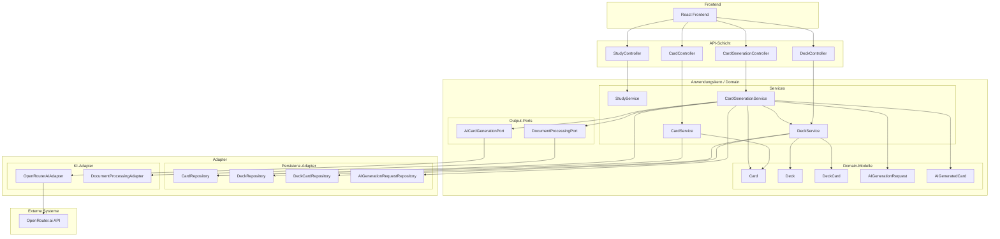
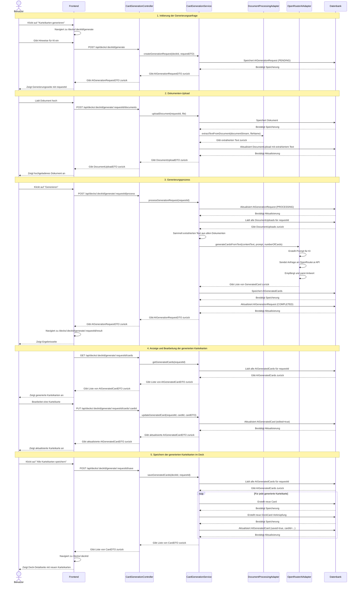

# Architekturentwurf: KI-gestützte Karteikartengenerierung

## Inhaltsverzeichnis

1. [Einleitung](#einleitung)
2. [Anforderungen](#anforderungen)
3. [Bestehende Architektur](#bestehende-architektur)
4. [Neue Komponenten](#neue-komponenten)
5. [Komponentendiagramm](#komponentendiagramm)
6. [Ports und Adapter](#ports-und-adapter)
7. [Datenmodell](#datenmodell)
8. [API-Endpunkte](#api-endpunkte)
9. [Datenfluss](#datenfluss)
10. [Sequenzdiagramm](#sequenzdiagramm)
11. [Konfiguration](#konfiguration)
12. [Vorteile der Architektur](#vorteile-der-architektur)
13. [Nächste Schritte](#nächste-schritte)

## Einleitung

Dieser Architekturentwurf beschreibt die Integration einer KI-gestützten Karteikartengenerierung in die bestehende Flashcard-Anwendung. Die Integration folgt den Prinzipien der hexagonalen Architektur, bei der der Anwendungskern über Ports mit der Außenwelt kommuniziert und die Adapter diese Ports implementieren.

## Anforderungen

### Fachliche Anforderungen

- Die Generierungsfunktion soll in einem bestehenden Deck angeboten werden
- Prozessablauf:
  1. Button im Deck führt auf eine neue Seite
  2. Auf der Seite können Hinweise für das KI-Modell eingegeben werden
  3. Dokumente (docx, pdf, text-basiert) können hochgeladen werden
  4. Generierung der Karteikarten wird per Button angestoßen
  5. Weiterleitung auf eine Ergebnisseite mit den generierten Karteikarten
  6. Button zum Speichern aller Karteikarten im Deck
  7. Karteikarten mit Vorder- und Rückseite, editierbar über Stiftsymbol

### Technische Anforderungen

- Spring AI 1.0.1 verwenden
- Openrouter.ai als KI-Provider mit API-Key
- Property für KI-Modell (z.B. "gpt-4o")
- Hexagonale Architektur: KI-Anbindung in einem Adapter, Anwendungskern greift über Output-Port zu

## Bestehende Architektur

Die bestehende Anwendung verwendet eine hexagonale Architektur mit folgenden Komponenten:

### Domänenmodelle
- **Card**: Karteikarte mit Vorder- und Rückseite sowie Tags
- **Deck**: Kartendeck mit Namen, Beschreibung und Tags
- **DeckCard**: Verknüpfung zwischen Karten und Decks (Many-to-Many-Beziehung)

### Services (Anwendungskern)
- **DeckService**: Verwaltet Decks und die Zuordnung von Karten zu Decks
- **CardService**: Verwaltet Karten
- **StudyService**: Verwaltet den Lernmodus

### Controller (API-Schicht)
- **DeckController**: API-Endpunkte für Decks
- **CardController**: API-Endpunkte für Karten
- **StudyController**: API-Endpunkte für den Lernmodus

### Repositories (Persistenz-Adapter)
- **DeckRepository**: Datenzugriff für Decks
- **CardRepository**: Datenzugriff für Karten
- **DeckCardRepository**: Datenzugriff für die Zuordnung von Karten zu Decks

## Neue Komponenten

Für die Integration der KI-gestützten Karteikartengenerierung werden folgende neue Komponenten benötigt:

### Neue Domänenmodelle
- **AIGenerationRequest**: Repräsentiert eine Anfrage zur KI-gestützten Karteikartengenerierung
  - Enthält Hinweise für das KI-Modell
  - Referenz zum Deck, für das Karten generiert werden sollen
  - Metadaten zu hochgeladenen Dokumenten

- **AIGeneratedCard**: Temporäres Modell für generierte Karteikarten vor dem Speichern
  - Enthält Vorder- und Rückseite
  - Status (bearbeitet/unbearbeitet)
  - Referenz zur Generierungsanfrage

- **DocumentUpload**: Speichert Informationen über hochgeladene Dokumente
  - Verknüpfung mit einer Generierungsanfrage
  - Metadaten zum Dokument (Dateiname, Typ, Größe)
  - Extrahierter Text aus dem Dokument

### Neue Services (Anwendungskern)
- **CardGenerationService**: Zentrale Komponente für die Karteikartengenerierung
  - Verarbeitet Anfragen zur Karteikartengenerierung
  - Koordiniert die Dokumentenverarbeitung und KI-Anfragen
  - Speichert generierte Karten im Deck

### Ports (Schnittstellen)
- **AICardGenerationPort** (Output-Port): Schnittstelle für die KI-Anbindung
  - Methode zur Generierung von Karteikarten basierend auf Text und Hinweisen
  
- **DocumentProcessingPort** (Output-Port): Schnittstelle für die Dokumentenverarbeitung
  - Methode zur Extraktion von Text aus verschiedenen Dokumentformaten (PDF, DOCX, etc.)

### Adapter (Implementierungen)
- **OpenRouterAIAdapter**: Implementiert den AICardGenerationPort
  - Kommuniziert mit der OpenRouter.ai API über Spring AI
  - Konfigurierbar mit verschiedenen KI-Modellen
  
- **DocumentProcessingAdapter**: Implementiert den DocumentProcessingPort
  - Extrahiert Text aus verschiedenen Dokumentformaten
  - Bereitet den Text für die KI-Anfrage auf

### Neue Controller
- **CardGenerationController**: API-Endpunkte für die Karteikartengenerierung
  - Endpunkt zum Starten einer Generierungsanfrage
  - Endpunkt zum Hochladen von Dokumenten
  - Endpunkt zum Abrufen generierter Karten
  - Endpunkt zum Speichern generierter Karten im Deck

### Neue DTOs
- **CardGenerationRequestDTO**: DTO für die Anfrage zur Karteikartengenerierung
- **DocumentUploadDTO**: DTO für hochgeladene Dokumente
- **AIGeneratedCardDTO**: DTO für generierte Karteikarten
- **AIGenerationRequestDTO**: DTO für eine Generierungsanfrage

### Konfiguration
- **AIConfig**: Konfigurationsklasse für die KI-Integration
  - API-Key für OpenRouter.ai
  - Konfiguration des KI-Modells
  - Weitere KI-spezifische Einstellungen

## Komponentendiagramm



## Ports und Adapter

### Output-Ports

#### 1. AICardGenerationPort

```java
package com.fao.flashcards.domain.port;

import java.util.List;

/**
 * Port für die KI-gestützte Generierung von Karteikarten.
 * Dieser Port wird vom Anwendungskern verwendet, um mit der KI zu kommunizieren.
 */
public interface AICardGenerationPort {
    
    /**
     * Generiert Karteikarten basierend auf dem übergebenen Text und den Hinweisen.
     * 
     * @param contentText Der Text, aus dem Karteikarten generiert werden sollen
     * @param prompt Hinweise für das KI-Modell zur Generierung der Karteikarten
     * @param numberOfCards Die gewünschte Anzahl an Karteikarten (optional)
     * @return Eine Liste von generierten Karteikarten mit Vorder- und Rückseite
     */
    List<GeneratedCard> generateCardsFromText(String contentText, String prompt, Integer numberOfCards);
    
    /**
     * Datenklasse für generierte Karteikarten.
     */
    class GeneratedCard {
        private String front;
        private String back;
        
        // Getter und Setter
    }
}
```

#### 2. DocumentProcessingPort

```java
package com.fao.flashcards.domain.port;

import java.io.InputStream;

/**
 * Port für die Verarbeitung von Dokumenten.
 * Dieser Port wird vom Anwendungskern verwendet, um Text aus verschiedenen Dokumentformaten zu extrahieren.
 */
public interface DocumentProcessingPort {
    
    /**
     * Extrahiert Text aus einem Dokument.
     * 
     * @param documentStream Der Dokumentinhalt als InputStream
     * @param fileName Der Dateiname mit Erweiterung (für die Bestimmung des Dateityps)
     * @return Der extrahierte Text
     * @throws DocumentProcessingException wenn bei der Verarbeitung ein Fehler auftritt
     */
    String extractTextFromDocument(InputStream documentStream, String fileName) throws DocumentProcessingException;
    
    /**
     * Exception für Fehler bei der Dokumentenverarbeitung.
     */
    class DocumentProcessingException extends Exception {
        public DocumentProcessingException(String message, Throwable cause) {
            super(message, cause);
        }
    }
}
```

### Adapter

#### 1. OpenRouterAIAdapter

```java
package com.fao.flashcards.adapter.ai;

import com.fao.flashcards.domain.port.AICardGenerationPort;
import org.springframework.ai.chat.ChatClient;
import org.springframework.ai.chat.ChatResponse;
import org.springframework.ai.chat.prompt.Prompt;
import org.springframework.ai.chat.prompt.SystemPromptTemplate;
import org.springframework.ai.chat.prompt.UserPromptTemplate;
import org.springframework.ai.openai.OpenAiChatOptions;
import org.springframework.beans.factory.annotation.Value;
import org.springframework.stereotype.Component;

import java.util.ArrayList;
import java.util.HashMap;
import java.util.List;
import java.util.Map;

/**
 * Adapter für die Kommunikation mit der OpenRouter.ai API über Spring AI.
 */
@Component
public class OpenRouterAIAdapter implements AICardGenerationPort {
    
    private final ChatClient chatClient;
    
    @Value("${ai.model}")
    private String aiModel;
    
    public OpenRouterAIAdapter(ChatClient chatClient) {
        this.chatClient = chatClient;
    }
    
    @Override
    public List<GeneratedCard> generateCardsFromText(String contentText, String prompt, Integer numberOfCards) {
        // Systemanweisung für das KI-Modell
        String systemPromptText = """
            Du bist ein Assistent, der Karteikarten für Lernzwecke erstellt.
            Erstelle Karteikarten mit einer Vorderseite (Frage/Konzept) und einer Rückseite (Antwort/Erklärung).
            Die Karteikarten sollten die wichtigsten Konzepte und Informationen aus dem bereitgestellten Text abdecken.
            Formatiere die Ausgabe als JSON-Array mit Objekten, die "front" und "back" Eigenschaften haben.
            """;
        
        // Benutzeranweisung mit dem Inhalt und den Hinweisen
        String userPromptText = """
            Erstelle Karteikarten basierend auf folgendem Text:
            
            {contentText}
            
            Zusätzliche Hinweise: {prompt}
            
            {numberOfCardsText}
            """;
        
        Map<String, Object> variables = new HashMap<>();
        variables.put("contentText", contentText);
        variables.put("prompt", prompt);
        variables.put("numberOfCardsText", numberOfCards != null ? "Erstelle genau " + numberOfCards + " Karteikarten." : "");
        
        SystemPromptTemplate systemPromptTemplate = new SystemPromptTemplate(systemPromptText);
        UserPromptTemplate userPromptTemplate = new UserPromptTemplate(userPromptText, variables);
        
        Prompt aiPrompt = new Prompt(List.of(systemPromptTemplate.createMessage(), userPromptTemplate.createMessage()));
        
        // Optionen für das KI-Modell setzen
        OpenAiChatOptions options = OpenAiChatOptions.builder()
                .withModel(aiModel)
                .withTemperature(0.7f)
                .build();
        
        // Anfrage an die KI senden
        ChatResponse response = chatClient.call(aiPrompt, options);
        
        // Antwort parsen und Karteikarten erstellen
        String responseContent = response.getResult().getOutput().getContent();
        
        // Hier würde die Logik zum Parsen der JSON-Antwort und Erstellen der Karteikarten folgen
        // Für diesen Architekturentwurf verwenden wir eine vereinfachte Implementierung
        
        List<GeneratedCard> generatedCards = new ArrayList<>();
        // Parsing-Logik hier...
        
        return generatedCards;
    }
}
```

#### 2. DocumentProcessingAdapter

```java
package com.fao.flashcards.adapter.document;

import com.fao.flashcards.domain.port.DocumentProcessingPort;
import org.apache.pdfbox.pdmodel.PDDocument;
import org.apache.pdfbox.text.PDFTextStripper;
import org.apache.poi.xwpf.extractor.XWPFWordExtractor;
import org.apache.poi.xwpf.usermodel.XWPFDocument;
import org.springframework.stereotype.Component;

import java.io.InputStream;

/**
 * Adapter für die Extraktion von Text aus verschiedenen Dokumentformaten.
 */
@Component
public class DocumentProcessingAdapter implements DocumentProcessingPort {
    
    @Override
    public String extractTextFromDocument(InputStream documentStream, String fileName) throws DocumentProcessingException {
        try {
            if (fileName.toLowerCase().endsWith(".pdf")) {
                return extractTextFromPdf(documentStream);
            } else if (fileName.toLowerCase().endsWith(".docx")) {
                return extractTextFromDocx(documentStream);
            } else if (fileName.toLowerCase().endsWith(".txt")) {
                return extractTextFromTxt(documentStream);
            } else {
                throw new DocumentProcessingException("Nicht unterstütztes Dateiformat: " + fileName, null);
            }
        } catch (Exception e) {
            throw new DocumentProcessingException("Fehler bei der Textextraktion: " + e.getMessage(), e);
        }
    }
    
    private String extractTextFromPdf(InputStream pdfStream) throws Exception {
        try (PDDocument document = PDDocument.load(pdfStream)) {
            PDFTextStripper stripper = new PDFTextStripper();
            return stripper.getText(document);
        }
    }
    
    private String extractTextFromDocx(InputStream docxStream) throws Exception {
        try (XWPFDocument document = new XWPFDocument(docxStream)) {
            XWPFWordExtractor extractor = new XWPFWordExtractor(document);
            return extractor.getText();
        }
    }
    
    private String extractTextFromTxt(InputStream txtStream) throws Exception {
        return new String(txtStream.readAllBytes());
    }
}
```

### Konfiguration für Spring AI und OpenRouter.ai

```java
package com.fao.flashcards.config;

import org.springframework.ai.openai.OpenAiChatClient;
import org.springframework.ai.openai.api.OpenAiApi;
import org.springframework.beans.factory.annotation.Value;
import org.springframework.context.annotation.Bean;
import org.springframework.context.annotation.Configuration;

/**
 * Konfiguration für die KI-Integration mit Spring AI und OpenRouter.ai.
 */
@Configuration
public class AIConfig {
    
    @Value("${ai.openrouter.api-key}")
    private String apiKey;
    
    @Value("${ai.openrouter.base-url:https://openrouter.ai/api/v1}")
    private String baseUrl;
    
    @Bean
    public OpenAiApi openAiApi() {
        return new OpenAiApi(apiKey, baseUrl);
    }
    
    @Bean
    public OpenAiChatClient openAiChatClient(OpenAiApi openAiApi) {
        return new OpenAiChatClient(openAiApi);
    }
}
```

## Datenmodell

### 1. AIGenerationRequest

```java
package com.fao.flashcards.domain.model;

import jakarta.persistence.*;
import lombok.Data;
import lombok.NoArgsConstructor;
import org.hibernate.annotations.CreationTimestamp;
import org.hibernate.annotations.UpdateTimestamp;

import java.time.LocalDateTime;
import java.util.ArrayList;
import java.util.List;
import java.util.UUID;

@Entity
@Table(name = "ai_generation_requests")
@Data
@NoArgsConstructor
public class AIGenerationRequest {
    
    @Id
    private String id;
    
    @Column(name = "deck_id", nullable = false)
    private String deckId;
    
    @Column(name = "prompt", columnDefinition = "TEXT")
    private String prompt;
    
    @Column(name = "status", nullable = false)
    @Enumerated(EnumType.STRING)
    private GenerationStatus status;
    
    @OneToMany(mappedBy = "generationRequest", cascade = CascadeType.ALL, orphanRemoval = true)
    private List<DocumentUpload> documents = new ArrayList<>();
    
    @OneToMany(mappedBy = "generationRequest", cascade = CascadeType.ALL, orphanRemoval = true)
    private List<AIGeneratedCard> generatedCards = new ArrayList<>();
    
    @CreationTimestamp
    @Column(name = "created_at")
    private LocalDateTime createdAt;
    
    @UpdateTimestamp
    @Column(name = "updated_at")
    private LocalDateTime updatedAt;
    
    @PrePersist
    protected void onCreate() {
        if (id == null) {
            id = UUID.randomUUID().toString();
        }
        if (status == null) {
            status = GenerationStatus.PENDING;
        }
    }
    
    public enum GenerationStatus {
        PENDING,
        PROCESSING,
        COMPLETED,
        FAILED
    }
}
```

### 2. DocumentUpload

```java
package com.fao.flashcards.domain.model;

import jakarta.persistence.*;
import lombok.Data;
import lombok.NoArgsConstructor;
import org.hibernate.annotations.CreationTimestamp;

import java.time.LocalDateTime;
import java.util.UUID;

@Entity
@Table(name = "document_uploads")
@Data
@NoArgsConstructor
public class DocumentUpload {
    
    @Id
    private String id;
    
    @ManyToOne
    @JoinColumn(name = "generation_request_id", nullable = false)
    private AIGenerationRequest generationRequest;
    
    @Column(name = "original_filename", nullable = false)
    private String originalFilename;
    
    @Column(name = "content_type", nullable = false)
    private String contentType;
    
    @Column(name = "file_size")
    private Long fileSize;
    
    @Column(name = "storage_path")
    private String storagePath;
    
    @Column(name = "extracted_text", columnDefinition = "TEXT")
    private String extractedText;
    
    @CreationTimestamp
    @Column(name = "uploaded_at")
    private LocalDateTime uploadedAt;
    
    @PrePersist
    protected void onCreate() {
        if (id == null) {
            id = UUID.randomUUID().toString();
        }
    }
}
```

### 3. AIGeneratedCard

```java
package com.fao.flashcards.domain.model;

import jakarta.persistence.*;
import lombok.Data;
import lombok.NoArgsConstructor;
import org.hibernate.annotations.CreationTimestamp;
import org.hibernate.annotations.UpdateTimestamp;

import java.time.LocalDateTime;
import java.util.UUID;

@Entity
@Table(name = "ai_generated_cards")
@Data
@NoArgsConstructor
public class AIGeneratedCard {
    
    @Id
    private String id;
    
    @ManyToOne
    @JoinColumn(name = "generation_request_id", nullable = false)
    private AIGenerationRequest generationRequest;
    
    @Column(nullable = false, columnDefinition = "TEXT")
    private String front;
    
    @Column(nullable = false, columnDefinition = "TEXT")
    private String back;
    
    @Column(name = "is_edited")
    private boolean edited;
    
    @Column(name = "is_saved")
    private boolean saved;
    
    @Column(name = "card_id")
    private String cardId;
    
    @CreationTimestamp
    @Column(name = "created_at")
    private LocalDateTime createdAt;
    
    @UpdateTimestamp
    @Column(name = "updated_at")
    private LocalDateTime updatedAt;
    
    @PrePersist
    protected void onCreate() {
        if (id == null) {
            id = UUID.randomUUID().toString();
        }
    }
}
```

### Datenbankmigrationen

```sql
-- V3__add_ai_generation_tables.sql

-- Tabelle für KI-Generierungsanfragen
CREATE TABLE ai_generation_requests (
    id VARCHAR(36) PRIMARY KEY,
    deck_id VARCHAR(36) NOT NULL,
    prompt TEXT,
    status VARCHAR(20) NOT NULL,
    created_at TIMESTAMP,
    updated_at TIMESTAMP,
    FOREIGN KEY (deck_id) REFERENCES decks(id)
);

-- Tabelle für hochgeladene Dokumente
CREATE TABLE document_uploads (
    id VARCHAR(36) PRIMARY KEY,
    generation_request_id VARCHAR(36) NOT NULL,
    original_filename VARCHAR(255) NOT NULL,
    content_type VARCHAR(100) NOT NULL,
    file_size BIGINT,
    storage_path VARCHAR(255),
    extracted_text TEXT,
    uploaded_at TIMESTAMP,
    FOREIGN KEY (generation_request_id) REFERENCES ai_generation_requests(id)
);

-- Tabelle für generierte Karteikarten
CREATE TABLE ai_generated_cards (
    id VARCHAR(36) PRIMARY KEY,
    generation_request_id VARCHAR(36) NOT NULL,
    front TEXT NOT NULL,
    back TEXT NOT NULL,
    is_edited BOOLEAN DEFAULT FALSE,
    is_saved BOOLEAN DEFAULT FALSE,
    card_id VARCHAR(36),
    created_at TIMESTAMP,
    updated_at TIMESTAMP,
    FOREIGN KEY (generation_request_id) REFERENCES ai_generation_requests(id),
    FOREIGN KEY (card_id) REFERENCES cards(id)
);
```

## API-Endpunkte

### CardGenerationController

```java
package com.fao.flashcards.api.controller;

import com.fao.flashcards.api.dto.*;
import com.fao.flashcards.domain.service.CardGenerationService;
import org.springframework.beans.factory.annotation.Autowired;
import org.springframework.http.HttpStatus;
import org.springframework.http.MediaType;
import org.springframework.http.ResponseEntity;
import org.springframework.web.bind.annotation.*;
import org.springframework.web.multipart.MultipartFile;

import java.util.List;

@RestController
@RequestMapping("/api/decks/{deckId}/generate")
public class CardGenerationController {

    private final CardGenerationService cardGenerationService;

    @Autowired
    public CardGenerationController(CardGenerationService cardGenerationService) {
        this.cardGenerationService = cardGenerationService;
    }

    /**
     * Startet eine neue Karteikartengenerierung für ein Deck.
     * 
     * @param deckId Die ID des Decks
     * @param requestDTO Die Anfrage mit Hinweisen für die KI
     * @return Die erstellte Generierungsanfrage
     */
    @PostMapping
    public ResponseEntity<AIGenerationRequestDTO> startGeneration(
            @PathVariable String deckId,
            @RequestBody CardGenerationRequestDTO requestDTO) {
        
        AIGenerationRequestDTO generationRequest = cardGenerationService.createGenerationRequest(deckId, requestDTO);
        return new ResponseEntity<>(generationRequest, HttpStatus.CREATED);
    }

    /**
     * Lädt ein Dokument für eine Generierungsanfrage hoch.
     * 
     * @param deckId Die ID des Decks
     * @param requestId Die ID der Generierungsanfrage
     * @param file Die hochzuladende Datei
     * @return Das hochgeladene Dokument
     */
    @PostMapping("/{requestId}/documents")
    public ResponseEntity<DocumentUploadDTO> uploadDocument(
            @PathVariable String deckId,
            @PathVariable String requestId,
            @RequestParam("file") MultipartFile file) {
        
        DocumentUploadDTO uploadedDocument = cardGenerationService.uploadDocument(requestId, file);
        return new ResponseEntity<>(uploadedDocument, HttpStatus.CREATED);
    }

    /**
     * Startet den Generierungsprozess für eine Anfrage.
     * 
     * @param deckId Die ID des Decks
     * @param requestId Die ID der Generierungsanfrage
     * @return Die aktualisierte Generierungsanfrage
     */
    @PostMapping("/{requestId}/process")
    public ResponseEntity<AIGenerationRequestDTO> processGeneration(
            @PathVariable String deckId,
            @PathVariable String requestId) {
        
        AIGenerationRequestDTO updatedRequest = cardGenerationService.processGenerationRequest(requestId);
        return ResponseEntity.ok(updatedRequest);
    }

    /**
     * Ruft den Status einer Generierungsanfrage ab.
     * 
     * @param deckId Die ID des Decks
     * @param requestId Die ID der Generierungsanfrage
     * @return Die Generierungsanfrage mit Status
     */
    @GetMapping("/{requestId}")
    public ResponseEntity<AIGenerationRequestDTO> getGenerationStatus(
            @PathVariable String deckId,
            @PathVariable String requestId) {
        
        AIGenerationRequestDTO generationRequest = cardGenerationService.getGenerationRequest(requestId);
        return ResponseEntity.ok(generationRequest);
    }

    /**
     * Ruft die generierten Karteikarten für eine Anfrage ab.
     * 
     * @param deckId Die ID des Decks
     * @param requestId Die ID der Generierungsanfrage
     * @return Die Liste der generierten Karteikarten
     */
    @GetMapping("/{requestId}/cards")
    public ResponseEntity<List<AIGeneratedCardDTO>> getGeneratedCards(
            @PathVariable String deckId,
            @PathVariable String requestId) {
        
        List<AIGeneratedCardDTO> generatedCards = cardGenerationService.getGeneratedCards(requestId);
        return ResponseEntity.ok(generatedCards);
    }

    /**
     * Aktualisiert eine generierte Karteikarte.
     * 
     * @param deckId Die ID des Decks
     * @param requestId Die ID der Generierungsanfrage
     * @param cardId Die ID der generierten Karteikarte
     * @param cardDTO Die aktualisierten Daten der Karteikarte
     * @return Die aktualisierte Karteikarte
     */
    @PutMapping("/{requestId}/cards/{cardId}")
    public ResponseEntity<AIGeneratedCardDTO> updateGeneratedCard(
            @PathVariable String deckId,
            @PathVariable String requestId,
            @PathVariable String cardId,
            @RequestBody AIGeneratedCardDTO cardDTO) {
        
        return ResponseEntity.ok(updatedCard);
    }

    /**
     * Speichert alle generierten Karteikarten im Deck.
     * 
     * @param deckId Die ID des Decks
     * @param requestId Die ID der Generierungsanfrage
     * @return Die Liste der gespeicherten Karteikarten
     */
    @PostMapping("/{requestId}/save")
    public ResponseEntity<List<CardDTO>> saveGeneratedCards(
            @PathVariable String deckId,
            @PathVariable String requestId) {
        
        List<CardDTO> savedCards = cardGenerationService.saveGeneratedCards(deckId, requestId);
        return ResponseEntity.ok(savedCards);
    }
}
```

### Neue DTOs für die KI-Integration

```java
package com.fao.flashcards.api.dto;

import lombok.Data;

/**
 * DTO für die Anfrage zur Karteikartengenerierung.
 */
@Data
public class CardGenerationRequestDTO {
    private String prompt;
    private Integer numberOfCards;
}
```

```java
package com.fao.flashcards.api.dto;

import lombok.Data;

/**
 * DTO für eine Generierungsanfrage.
 */
@Data
public class AIGenerationRequestDTO {
    private String id;
    private String deckId;
    private String prompt;
    private String status;
    private String createdAt;
    private String updatedAt;
    private int documentCount;
    private int generatedCardCount;
}
```

```java
package com.fao.flashcards.api.dto;

import lombok.Data;

/**
 * DTO für ein hochgeladenes Dokument.
 */
@Data
public class DocumentUploadDTO {
    private String id;
    private String originalFilename;
    private String contentType;
    private Long fileSize;
    private String uploadedAt;
}
```

```java
package com.fao.flashcards.api.dto;

import lombok.Data;

/**
 * DTO für eine generierte Karteikarte.
 */
@Data
public class AIGeneratedCardDTO {
    private String id;
    private String front;
    private String back;
    private boolean edited;
    private boolean saved;
    private String createdAt;
    private String updatedAt;
}
```

## Datenfluss

Der Datenfluss für die KI-gestützte Karteikartengenerierung umfasst mehrere Schritte, die den Prozessablauf von der Benutzeroberfläche bis zur KI-Anbindung und zurück beschreiben:

### 1. Initiierung der Generierungsanfrage

1. Der Benutzer navigiert zu einem bestehenden Deck und klickt auf den Button "Karteikarten generieren".
2. Das Frontend leitet den Benutzer zur Generierungsseite (`/decks/:deckId/generate`) weiter.
3. Der Benutzer gibt Hinweise für das KI-Modell ein.
4. Das Frontend sendet eine POST-Anfrage an `/api/decks/:deckId/generate` mit den Hinweisen.
5. Der `CardGenerationController` empfängt die Anfrage und leitet sie an den `CardGenerationService` weiter.
6. Der `CardGenerationService` erstellt eine neue `AIGenerationRequest`-Entität mit Status "PENDING" und speichert sie in der Datenbank.
7. Die Antwort mit der erstellten Anfrage wird an das Frontend zurückgesendet.

### 2. Dokumenten-Upload

1. Der Benutzer lädt ein oder mehrere Dokumente (PDF, DOCX, TXT) auf der Generierungsseite hoch.
2. Das Frontend sendet für jedes Dokument eine POST-Anfrage an `/api/decks/:deckId/generate/:requestId/documents` mit dem Dokument als Multipart-Datei.
3. Der `CardGenerationController` empfängt die Anfrage und leitet sie an den `CardGenerationService` weiter.
4. Der `CardGenerationService` speichert das Dokument und erstellt eine neue `DocumentUpload`-Entität.
5. Der `CardGenerationService` verwendet den `DocumentProcessingPort`, um Text aus dem Dokument zu extrahieren.
6. Der `DocumentProcessingAdapter` implementiert den Port und extrahiert den Text aus dem Dokument je nach Dateityp.
7. Der extrahierte Text wird in der `DocumentUpload`-Entität gespeichert.
8. Die Antwort mit dem hochgeladenen Dokument wird an das Frontend zurückgesendet.

### 3. Generierungsprozess

1. Der Benutzer klickt auf den Button "Generieren", um den Generierungsprozess zu starten.
2. Das Frontend sendet eine POST-Anfrage an `/api/decks/:deckId/generate/:requestId/process`.
3. Der `CardGenerationController` empfängt die Anfrage und leitet sie an den `CardGenerationService` weiter.
4. Der `CardGenerationService` aktualisiert den Status der Anfrage auf "PROCESSING".
5. Der `CardGenerationService` sammelt den extrahierten Text aus allen hochgeladenen Dokumenten.
6. Der `CardGenerationService` verwendet den `AICardGenerationPort`, um Karteikarten zu generieren.
7. Der `OpenRouterAIAdapter` implementiert den Port und kommuniziert mit der OpenRouter.ai API über Spring AI.
8. Die API-Anfrage enthält den extrahierten Text, die Hinweise des Benutzers und die gewünschte Anzahl an Karteikarten.
9. Die OpenRouter.ai API generiert Karteikarten und sendet sie zurück.
10. Der `OpenRouterAIAdapter` parst die Antwort und erstellt `GeneratedCard`-Objekte.
11. Der `CardGenerationService` erstellt für jede generierte Karteikarte eine `AIGeneratedCard`-Entität und speichert sie in der Datenbank.
12. Der `CardGenerationService` aktualisiert den Status der Anfrage auf "COMPLETED".
13. Die Antwort mit der aktualisierten Anfrage wird an das Frontend zurückgesendet.
14. Das Frontend leitet den Benutzer zur Ergebnisseite (`/decks/:deckId/generate/:requestId/result`) weiter.

### 4. Anzeige und Bearbeitung der generierten Karteikarten

1. Das Frontend sendet eine GET-Anfrage an `/api/decks/:deckId/generate/:requestId/cards`, um die generierten Karteikarten abzurufen.
2. Der `CardGenerationController` empfängt die Anfrage und leitet sie an den `CardGenerationService` weiter.
3. Der `CardGenerationService` ruft alle `AIGeneratedCard`-Entitäten für die Anfrage ab und konvertiert sie in DTOs.
4. Die Antwort mit den generierten Karteikarten wird an das Frontend zurückgesendet.
5. Das Frontend zeigt die generierten Karteikarten mit Vorder- und Rückseite an.
6. Der Benutzer kann einzelne Karteikarten über das Stiftsymbol bearbeiten.
7. Wenn der Benutzer eine Karteikarte bearbeitet, sendet das Frontend eine PUT-Anfrage an `/api/decks/:deckId/generate/:requestId/cards/:cardId` mit den aktualisierten Daten.
8. Der `CardGenerationController` empfängt die Anfrage und leitet sie an den `CardGenerationService` weiter.
9. Der `CardGenerationService` aktualisiert die `AIGeneratedCard`-Entität und markiert sie als bearbeitet.
10. Die Antwort mit der aktualisierten Karteikarte wird an das Frontend zurückgesendet.

### 5. Speichern der generierten Karteikarten im Deck

1. Der Benutzer klickt auf den Button "Alle Karteikarten speichern", um die generierten Karteikarten im Deck zu speichern.
2. Das Frontend sendet eine POST-Anfrage an `/api/decks/:deckId/generate/:requestId/save`.
3. Der `CardGenerationController` empfängt die Anfrage und leitet sie an den `CardGenerationService` weiter.
4. Der `CardGenerationService` ruft alle `AIGeneratedCard`-Entitäten für die Anfrage ab.
5. Für jede generierte Karteikarte erstellt der `CardGenerationService` eine neue `Card`-Entität und speichert sie in der Datenbank.
6. Der `CardGenerationService` verwendet den `DeckService`, um die neuen Karten dem Deck hinzuzufügen.
7. Der `CardGenerationService` aktualisiert die `AIGeneratedCard`-Entitäten und markiert sie als gespeichert.
8. Die Antwort mit den gespeicherten Karteikarten wird an das Frontend zurückgesendet.
9. Das Frontend leitet den Benutzer zur Deck-Detailseite (`/decks/:deckId`) weiter.

## Sequenzdiagramm



## Konfiguration

Die KI-Integration wird über folgende Konfigurationsparameter in der `application.properties` (bzw. `application-dev.properties` oder `application-prod.properties`) gesteuert:

```properties
# KI-Konfiguration
ai.openrouter.api-key=abc
ai.openrouter.base-url=https://openrouter.ai/api/v1
ai.model=gpt-4o
```

## Vorteile der Architektur

1. **Lose Kopplung**: Die hexagonale Architektur ermöglicht eine lose Kopplung zwischen dem Anwendungskern und externen Systemen wie der KI-API.
2. **Austauschbarkeit**: Die KI-Anbindung kann leicht ausgetauscht werden, indem ein neuer Adapter für den AICardGenerationPort implementiert wird.
3. **Testbarkeit**: Die klare Trennung zwischen Anwendungskern und Adaptern erleichtert das Testen der Geschäftslogik.
4. **Erweiterbarkeit**: Die Architektur kann leicht um weitere Funktionen erweitert werden, z.B. um weitere KI-Modelle oder Dokumentformate.

## Nächste Schritte

1. **Implementierung der Komponenten**: Umsetzung der definierten Komponenten gemäß dem Architekturentwurf
2. **Datenbankmigrationen**: Erstellung der neuen Tabellen für die KI-Integration
3. **Frontend-Implementierung**: Entwicklung der Benutzeroberfläche für die Karteikartengenerierung
4. **Tests**: Erstellung von Unit- und Integrationstests für die neuen Komponenten
5. **Dokumentation**: Erstellung einer Dokumentation für die KI-Integration
        AIGeneratedCardDTO updatedCard = cardGenerationService.updateGeneratedCard(requestId, cardId, cardDTO);